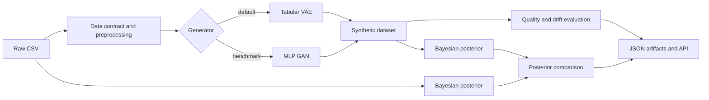

# Synthetic Data & Bayesian Analytics Platform

Production-minded reference project for generating mixed-type tabular synthetic data with deep generative models and validating it with Bayesian statistics.

The platform demonstrates an end-to-end AI Engineering workflow:



## Why this project matters

Synthetic data is only useful when it preserves the statistical structure needed by downstream consumers without copying sensitive records. This repository therefore treats generation, quality evaluation, uncertainty quantification, and reproducibility as one pipeline.

The MVP includes:

- a mixed-type tabular preprocessor for numeric and categorical columns;
- a PyTorch variational autoencoder as the primary generator;
- a small MLP GAN as a comparative baseline;
- a PySpark data-engineering layer for distributed CSV ingestion, profiling, Parquet materialization, and Spark-based evaluation;
- distribution drift reports for numeric and categorical features;
- a conjugate Normal-Inverse-Gamma Bayesian posterior for numeric columns;
- posterior comparison between real and synthetic datasets;
- a CLI, optional FastAPI service, Docker image, and automated tests.

The GAN is intentionally a transparent baseline, not a claim that it replaces a full CTGAN implementation. A natural next step is to add conditional sampling and compare this baseline with SDV/CTGAN on larger datasets.

## Quickstart

```bash
python -m venv .venv
source .venv/bin/activate
python -m pip install -e ".[dev]"
python -m pytest -q
```

For the full Spark-enabled environment:

```bash
python -m pip install -e ".[full]"
```

Run the VAE pipeline:

```bash
python -m synthetic_data_platform.cli run \
  --input data/raw/customer_events.csv \
  --output artifacts \
  --model vae \
  --epochs 120 \
  --samples 500
```

Run the GAN baseline:

```bash
python -m synthetic_data_platform.cli run \
  --input data/raw/customer_events.csv \
  --output artifacts \
  --model gan \
  --epochs 120 \
  --samples 500
```

Each run creates a timestamped artifact directory containing:

- `synthetic.csv`;
- `quality_report.json`;
- `bayesian_report.json`;
- `metadata.json` with configuration and training information.

## PySpark data-engineering layer

PySpark is used where it adds real value: scalable ingestion, schema discovery, null/duplicate checks, numeric profiling, Parquet materialization, and distributed comparison of real and synthetic data. The neural generator remains in PyTorch, which keeps the VAE/GAN training code simple and lets Spark focus on distributed data processing.

Profile a dataset with Spark:

```bash
python -m synthetic_data_platform.cli spark-profile \
  --input data/raw/customer_events.csv
```

Materialize a CSV as Parquet:

```bash
python -m synthetic_data_platform.cli spark-materialize \
  --input data/raw/customer_events.csv \
  --output artifacts/customer_events_parquet
```

Run the generative pipeline with a Spark profiling stage:

```bash
python -m synthetic_data_platform.cli run \
  --input data/raw/customer_events.csv \
  --output artifacts \
  --model vae \
  --epochs 120 \
  --samples 500 \
  --use-spark
```

The resulting artifact directory also contains `spark_profile.json`.

Compare two CSV datasets through Spark aggregations:

```bash
python -m synthetic_data_platform.cli spark-evaluate \
  --real data/raw/customer_events.csv \
  --synthetic artifacts/<run_id>/synthetic.csv
```

## CLI commands

```bash
python -m synthetic_data_platform.cli profile --input data/raw/customer_events.csv
python -m synthetic_data_platform.cli evaluate --real real.csv --synthetic synthetic.csv
python -m synthetic_data_platform.cli bayes --real real.csv --synthetic synthetic.csv
```

## Optional API

```bash
python -m pip install -e ".[api]"
uvicorn synthetic_data_platform.api:app --reload
```

Example request:

```bash
curl -X POST http://localhost:8000/generate \
  -H "Content-Type: application/json" \
  -d '{"input_path":"data/raw/customer_events.csv","output_dir":"artifacts","model":"vae","epochs":120,"samples":500}'
```

## Bayesian method

For each numeric column, the pipeline uses a weak Normal-Inverse-Gamma prior and samples the posterior distribution of the column mean. The report includes a posterior mean, a 95% credible interval, and the probability that the real-data mean is greater than the synthetic-data mean.

This is deliberately explicit and dependency-light. For richer hierarchical models, replace the conjugate implementation with PyMC while keeping the same pipeline contract.

## Data quality and privacy caveat

The quality score is a diagnostic, not a certification. Before using synthetic data in a real organization, add domain-specific constraints, membership-inference testing, nearest-neighbor disclosure checks, and human review. A generative model alone does not guarantee privacy.

## Project layout

```text
src/synthetic_data_platform/
├── api.py                 # Optional FastAPI service
├── bayesian.py            # Posterior estimation and comparison
├── cli.py                 # Command-line interface
├── evaluation.py          # Distribution and quality reports
├── io.py                  # CSV loading and data contracts
├── pipeline.py            # End-to-end orchestration
├── preprocessing.py       # Mixed-type tabular encoding
├── spark_engine.py        # Spark ingestion, profiling and evaluation
└── models/
    ├── gan.py             # MLP GAN baseline
    └── vae.py             # Primary VAE generator
```

## Roadmap

- conditional generation by category or target segment;
- Great Expectations or Pandera data contracts;
- MLflow experiment tracking;
- privacy risk metrics and synthetic-vs-real nearest-neighbor analysis;
- PyMC hierarchical Bayesian models;
- Prefect/Dagster orchestration and cloud object storage;
- model registry and signed artifact manifests.

## Suggested LinkedIn summary

> Built an end-to-end Synthetic Data & Bayesian Analytics Platform with PyTorch VAE/GAN models, data quality evaluation, posterior uncertainty analysis, reproducible artifacts, CLI/API interfaces, Docker, and automated testing.
